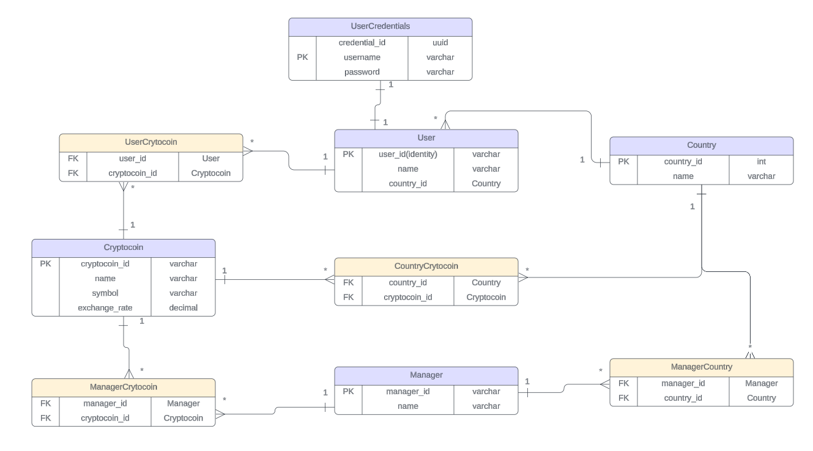
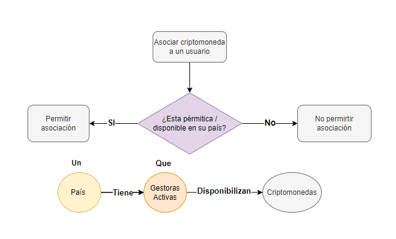

# Proyecto Asociación Criptomonedas - prueba técnica Nivel 1 Bancolombia
## Desarrolladora - Laura Vanesa Tascón Cataño - Ing se sistemas 

## 2. Bases de datos 
### 2.1. Elección de la DB

### 2.2. Diagrama entidad relación

### Diagrama de flujo
